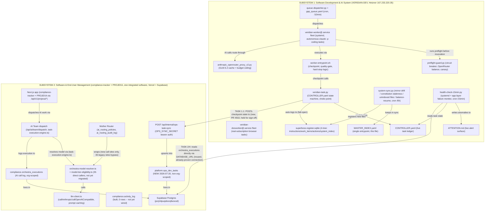

# VERIDIAN System Diagram

Auto-generated by `ai-os/scripts/generate-system-diagram.py` -- 23 components,
21 edges. Every component/edge was verified to actually exist as of the
generation date below (not aspirational). To update: edit the SUBSYSTEMS/EDGES
data in that script and re-run it, do not hand-edit this file's diagram block.

Generated: 2026-07-20

## Two subsystems (Owner's own framing, 2026-07-20 directive)

## Reading this diagram

- **Subsystem 1** runs entirely on VERIDIAN-DEV (Hetzner, 167.233.220.35) --
  the autonomous coding-task worker fleet, its own SQLite register, and the
  scripts that keep it internally consistent (`system-sync.py`,
  `health-check-15min.py`).
- **Subsystem 2** is the actual product -- compliance-tracker and PROJEXA,
  treated as one integrated software per Owner directive, deployed on
  Vercel with a Supabase Postgres backend.
- **The two bridge edges at the bottom are the newest work** (2026-07-20,
  TASKS 1.1 and 2/4) -- before this pass, these two subsystems had zero
  connection to each other's task/failure state. TASK 1.1's bridge (ops to
  app, write path, via a new API route) is still open for Owner sign-off
  (`PR #502`, Tier2: schema + new secret). TASK 2/4's bridge (app to ops,
  read path) is already live, reusing an existing, already-proven database
  connection rather than new infrastructure.
- **35 unmigrated AI-router call sites** (`s2_resolver`) are a known,
  deliberately-deferred gap -- see
  `ai-os/MASTER_INDEX.yaml registries.ai_router_migration_inventory_2026_07_20`
  for the full reasoning and file list.
